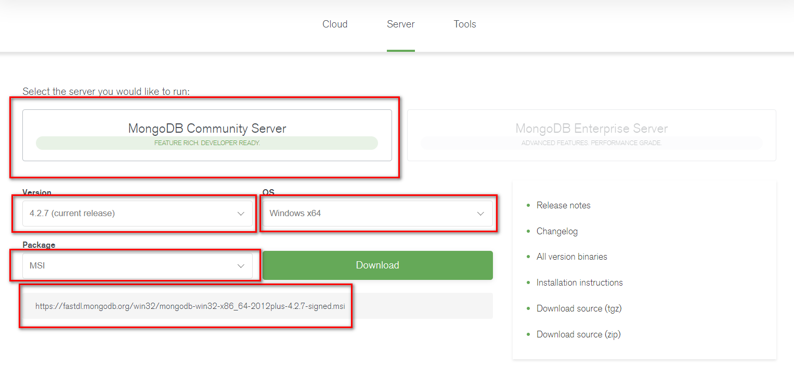
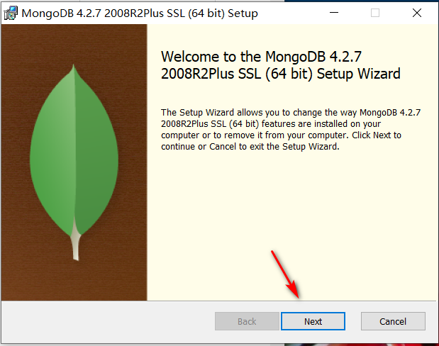
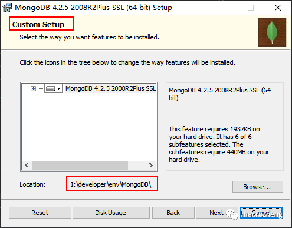
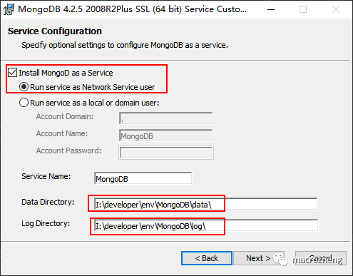
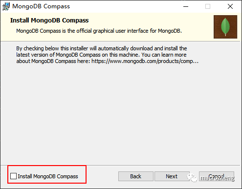
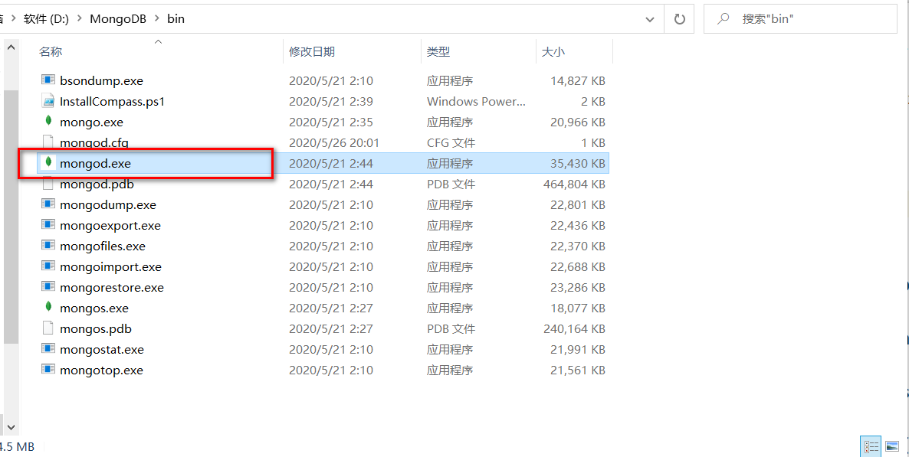
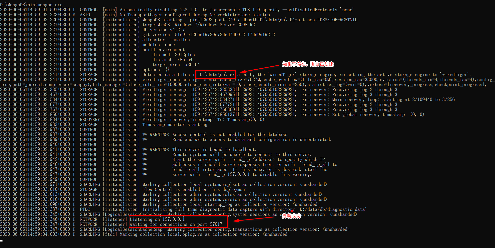
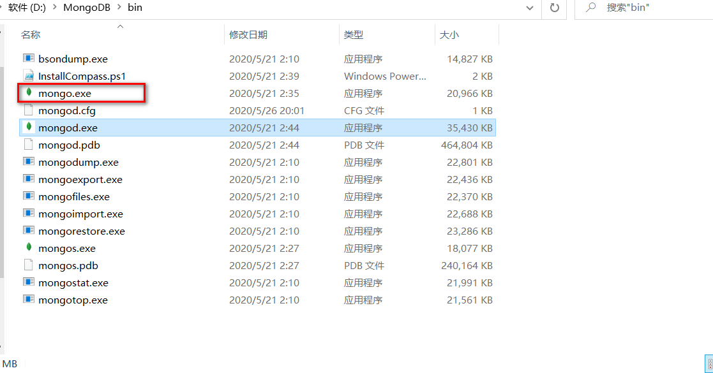
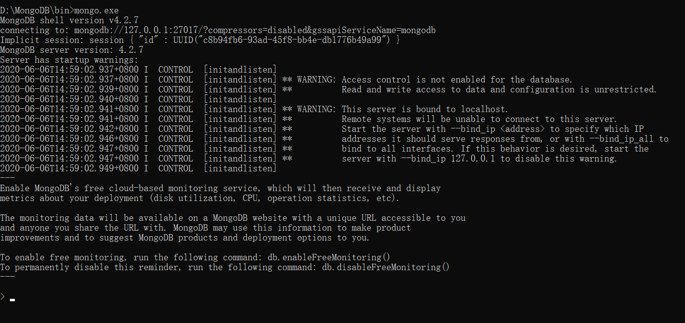
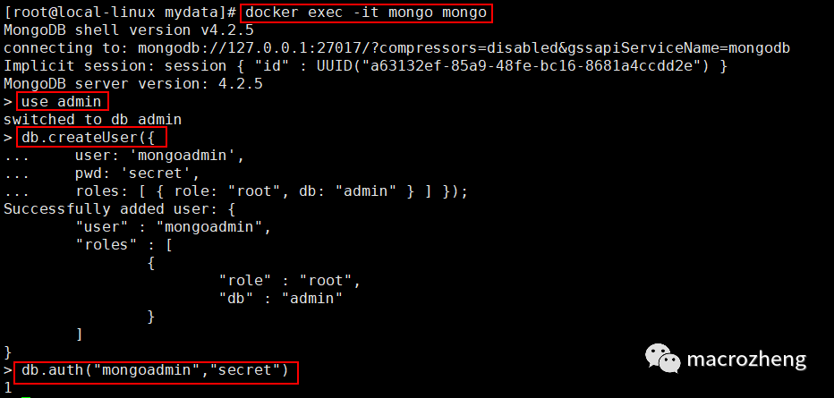

# MongoDB安装

>虽说现在关系型数据库还是主流，但是面对某些需求的时候，需要非关系型数据库来补充它，学习一个主流的NoSQL数据库还是很有必要的。MongoDB是一个功能丰富的NoSQL数据库，本文整理了它最常用的部分形成了这篇入门教程，希望对大家有所帮助。

## 简介

MongoDB是一个基于分布式文件存储的数据库。由C++语言编写，旨在为WEB应用提供可扩展的高性能数据存储解决方案。MongoDB是一个介于关系型数据库和非关系型数据库之间的产品，是非关系型数据库当中功能最丰富，最像关系型数据库的。

## 安装

以前写的MongoDB安装教程是基于3.2版本的，发现有的朋友使用新版本安装有问题，这次我们使用最新版本再来安装一次，本文所使用的MongoDB版本为4.2.5，总的来说，新版本的安装更简单了。

### Windows下的安装
 * 下载MongoDB安装包，选择Windows x64版本安装，下载地址：https://www.mongodb.com/download-center/community
 
 

 * 运行MongoDB安装包并选择自定义安装，设置好安装路径；
 
 
 
 
 
 * 配置MongoDB，让MongoDB作为服务运行，并配置好数据目录和日志目录；
 
 
 
 * 取消MongoDB Compass的安装选项（不取消安装极慢），需要可自行安装；
 
 
 
 * 双击`mongod.exe`
 
 
 
 
 
 * 双击mongo.exe可以运行MongoDB自带客户端，操作MongoDB；
 
 
 
 * 连接成功后会显示如下信息；
 
 
 
###  Linux下的安装

 * 下载MongoDB的Docker镜像；
 ```
docker pull mongo:4.2.7
```
 * 使用Docker命令启动MongoDB服务；
 ```
docker run -p 27017:27017 --name mongo \
-v /mydata/mongo/db:/data/db \
-d mongo:4.2.7
```
 * 有时候我们需要为MongoDB设置账号，可以使用如下命令启动；
 ```
docker run -p 27017:27017 --name mongo \
-v /mydata/mongo/db:/data/db \
-d mongo:4.2.7 --auth
```
 * 然后我们需要进入容器中的MongoDB客户端；
```
docker exec -it mongo mongo
```
 * 之后在admin集合中创建一个账号用于连接，这里创建的是基于root角色的超级管理员帐号；
 ```
use admin
db.createUser({
    user: 'mongoadmin',
    pwd: 'secret',
    roles: [ { role: "root", db: "admin" } ] });
```
* 创建完成后验证是否可以登录；
```
db.auth("mongoadmin","secret")
```
* 整个账号创建过程可以参考下图。

