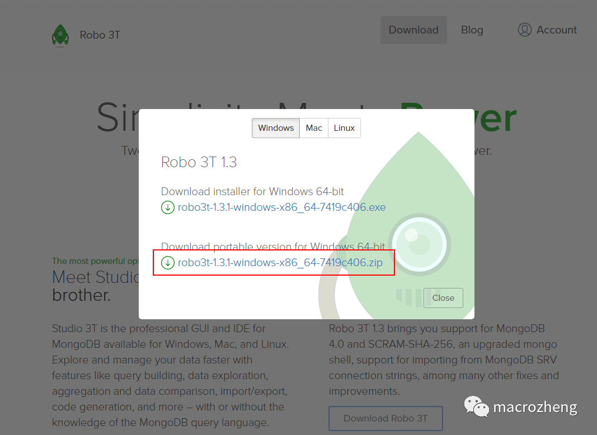
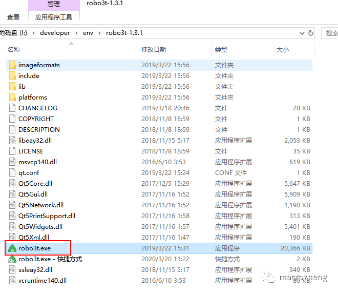
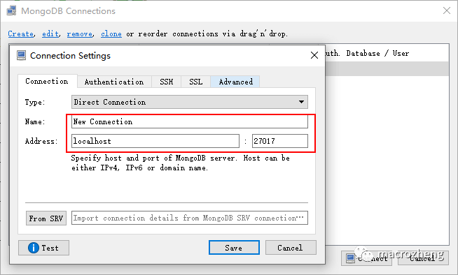
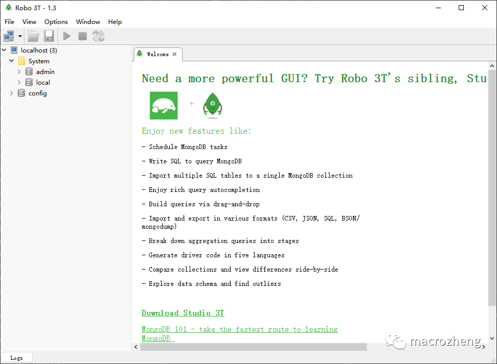

# 客户端工具

>  MongoDB的客户端工具有很多，上面没安装的MongoDB Compass就是其中之一，另外Navicat 15版本也有MongoDB的管理功能。这里我们使用的是一款免费的客户端工具Robo 3T（以前叫Robomongo）。

* 首先下载客户端工具，下载地址：https://robomongo.org/download

* 下载完成后解压，双击robo3t.exe即可使用；

* 之后创建一个到MongoDB的连接；

* 创建连接成功以后，就可以操作MongoDB了。

