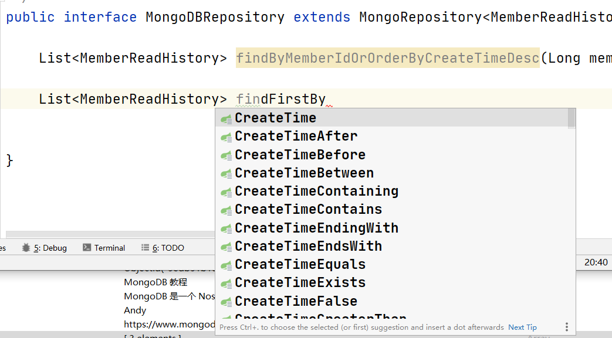

# SpringBoot操作MongoDB

## maven依赖

```xml
<?xml version="1.0" encoding="UTF-8"?>
<project xmlns="http://maven.apache.org/POM/4.0.0" xmlns:xsi="http://www.w3.org/2001/XMLSchema-instance"
         xsi:schemaLocation="http://maven.apache.org/POM/4.0.0 https://maven.apache.org/xsd/maven-4.0.0.xsd">
    <modelVersion>4.0.0</modelVersion>
    <parent>
        <groupId>org.springframework.boot</groupId>
        <artifactId>spring-boot-starter-parent</artifactId>
        <version>2.3.0.RELEASE</version>
        <relativePath/> <!-- lookup parent from repository -->
    </parent>
    <groupId>com.kenny</groupId>
    <artifactId>springboot-mongodb</artifactId>
    <version>0.0.1-SNAPSHOT</version>
    <name>springboot-mongodb</name>
    <description>springboot-mongodb</description>

    <properties>
        <java.version>1.8</java.version>
    </properties>

    <dependencies>
        <dependency>
            <groupId>org.springframework.boot</groupId>
            <artifactId>spring-boot-starter-data-mongodb</artifactId>
        </dependency>
        <dependency>
            <groupId>org.springframework.boot</groupId>
            <artifactId>spring-boot-starter-web</artifactId>
        </dependency>

        <dependency>
            <groupId>org.springframework.boot</groupId>
            <artifactId>spring-boot-devtools</artifactId>
            <scope>runtime</scope>
            <optional>true</optional>
        </dependency>
        <dependency>
            <groupId>org.springframework.boot</groupId>
            <artifactId>spring-boot-configuration-processor</artifactId>
            <optional>true</optional>
        </dependency>
        <dependency>
            <groupId>org.projectlombok</groupId>
            <artifactId>lombok</artifactId>
            <optional>true</optional>
        </dependency>
        <dependency>
            <groupId>org.springframework.boot</groupId>
            <artifactId>spring-boot-starter-test</artifactId>
            <scope>test</scope>
            <exclusions>
                <exclusion>
                    <groupId>org.junit.vintage</groupId>
                    <artifactId>junit-vintage-engine</artifactId>
                </exclusion>
            </exclusions>
        </dependency>
    </dependencies>

    <build>
        <plugins>
            <plugin>
                <groupId>org.springframework.boot</groupId>
                <artifactId>spring-boot-maven-plugin</artifactId>
            </plugin>
        </plugins>
    </build>

</project>

```

## Spring Data Mongodb

>和Spring Data Elasticsearch类似，Spring Data Mongodb是Spring提供的一种以Spring Data风格来操作数据存储的方式，它可以避免编写大量的样板代码。

### 常用注解

 * @Document:标示映射到Mongodb文档上的领域对象
   
 * @Id:标示某个域为ID域
   
 * @Indexed:标示某个字段为Mongodb的索引字段
 
### Sping Data方式的数据操作

**继承MongoRepository接口可以获得常用的数据操作方法**


**可以使用衍生查询**

>在接口中直接指定查询方法名称便可查询，无需进行实现，以下为根据id按时间倒序获取信息的例子

```java
public interface MongoDBRepository extends MongoRepository<MemberReadHistory, String> {

    List<MemberReadHistory> findByMemberIdOrOrderByCreateTimeDesc(Long memberId);


}
```
>在idea中直接会提示对应字段



**使用@Query注解可以用Mongodb的JSON查询语句进行查询**
```
@Query("{ 'memberId' : ?0 }")
List<MemberReadHistory> findByMemberId(Long memberId);
```
### 整合Mongodb实现文档操作

修改SpringBoot配置文件

>修改application.yml文件，在spring:data节点下添加Mongodb相关配置。

```yaml
mongodb:
  host: localhost # mongodb的连接地址
  port: 27017 # mongodb的连接端口号
  database: mall-port # mongodb的连接的数据库
```
**添加会员浏览记录文档对象MemberReadHistory**

> 文档对象的ID域添加@Id注解，需要检索的字段添加@Indexed注解。

```java
package com.kenny.entity;

import lombok.Data;
import org.springframework.data.annotation.Id;
import org.springframework.data.mongodb.core.index.Indexed;
import org.springframework.data.mongodb.core.mapping.Document;

import java.util.Date;

/**
 * ClassName: MemberReadHistory
 * Function:  TODO
 * Date:      2020/6/6 18:58
 *
 * @author Kenny
 * version    V1.0
 */
@Document
@Data
public class MemberReadHistory {

    @Id
    private String id;
    @Indexed
    private Long memberId;
    private String memberNickname;
    private String memberIcon;
    @Indexed
    private Long productId;
    private String productName;
    private String productPic;
    private String productSubTitle;
    private String productPrice;
    private Date createTime;

}

```
**添加MongoDBRepository接口用于操作Mongodb**
> 继承MongoRepository接口，这样就拥有了一些基本的Mongodb数据操作方法，同时定义了一个衍生查询方法

```java
package com.kenny.repository;

import com.kenny.entity.MemberReadHistory;
import org.springframework.data.mongodb.repository.MongoRepository;

import java.util.List;

/**
 * ClassName: MongoDBRepository
 * Function:  TODO
 * Date:      2020/6/6 18:46
 *
 * @author Kenny
 * version    V1.0
 */
public interface MongoDBRepository extends MongoRepository<MemberReadHistory, String> {

    List<MemberReadHistory> findMemberReadHistoriesByMemberId(Long memberId);


}
```
**添加MongoDBService接口**
```java
package com.kenny.service;

import com.kenny.entity.MemberReadHistory;

import java.util.List;

/**
 * ClassName: MongoDBService
 * Function:  TODO
 * Date:      2020/6/6 19:14
 *
 * @author Kenny
 * version    V1.0
 */
public interface MongoDBService {

    int create(MemberReadHistory memberReadHistory);

    int delete(List<String> ids);

    List<MemberReadHistory> list(Long memberId);
}
```
**添加MongoDBService接口实现类MongoDBServiceImpl**
```java
package com.kenny.service.impl;

import com.kenny.entity.MemberReadHistory;
import com.kenny.repository.MongoDBRepository;
import com.kenny.service.MongoDBService;
import org.springframework.beans.factory.annotation.Autowired;
import org.springframework.stereotype.Service;

import java.util.ArrayList;
import java.util.Date;
import java.util.List;

/**
 * ClassName: MongoDBServiceImpl
 * Function:  TODO
 * Date:      2020/6/6 19:43
 *
 * @author Kenny
 * version    V1.0
 */
@Service
public class MongoDBServiceImpl implements MongoDBService {

    @Autowired
    private MongoDBRepository mongoDBRepository;
    @Override
    public int create(MemberReadHistory memberReadHistory) {
        memberReadHistory.setId(null);
        memberReadHistory.setCreateTime(new Date());
        mongoDBRepository.save(memberReadHistory);
        return 1;
    }

    @Override
    public int delete(List<String> ids) {
        List<MemberReadHistory> deleteList = new ArrayList<>();
        for (String id : ids) {
            MemberReadHistory memberReadHistory = new MemberReadHistory();
            memberReadHistory.setId(id);
            deleteList.add(memberReadHistory);
        }
        mongoDBRepository.deleteAll(deleteList);
        return ids.size();
    }

    @Override
    public List<MemberReadHistory> list(Long memberId) {
        return mongoDBRepository.findMemberReadHistoriesByMemberId(memberId);
    }
}
```
**添加MongoDBController定义接口**
```java
package com.kenny.controller;

import com.kenny.entity.MemberReadHistory;
import com.kenny.service.MongoDBService;
import org.springframework.beans.factory.annotation.Autowired;
import org.springframework.stereotype.Controller;
import org.springframework.web.bind.annotation.RequestMapping;
import org.springframework.web.bind.annotation.ResponseBody;

import java.util.Arrays;
import java.util.Date;
import java.util.List;

/**
 * ClassName: MongoDBController
 * Function:  TODO
 * Date:      2020/6/6 19:50
 *
 * @author Kenny
 * version    V1.0
 */
@Controller
@RequestMapping("/mongdb")
public class MongoDBController {

    @Autowired
    private MongoDBService mongoDBService;

    @RequestMapping("/create")
    @ResponseBody
    public int create() {
        MemberReadHistory memberReadHistory = new MemberReadHistory();
        memberReadHistory.setId(null);
        memberReadHistory.setCreateTime(new Date());
        memberReadHistory.setMemberIcon("ic0n");
        memberReadHistory.setMemberId(1L);
        memberReadHistory.setMemberNickname("nickName");
        memberReadHistory.setProductId(2L);
        memberReadHistory.setProductName("productName");
        memberReadHistory.setProductPic("pic");
        memberReadHistory.setProductPrice("price");
        memberReadHistory.setProductSubTitle("title");
        return mongoDBService.create(memberReadHistory);
    }

    @RequestMapping("/delete")
    @ResponseBody
    public int delete() {
        return mongoDBService.delete(Arrays.asList("", ""));
    }

    @RequestMapping("/list")
    @ResponseBody
    public List<MemberReadHistory> list(Long meberId) {
        return mongoDBService.list(meberId);
    }
}
```

### 进行接口测试

**create测试**


**list测试**


**delete测试**

