# MongoDB操作API

## MongoDB Driver

> 引入maven依赖

```xml
<?xml version="1.0" encoding="UTF-8"?>
<project xmlns="http://maven.apache.org/POM/4.0.0" xmlns:xsi="http://www.w3.org/2001/XMLSchema-instance"
         xsi:schemaLocation="http://maven.apache.org/POM/4.0.0 https://maven.apache.org/xsd/maven-4.0.0.xsd">
    <modelVersion>4.0.0</modelVersion>
    <parent>
        <groupId>org.springframework.boot</groupId>
        <artifactId>spring-boot-starter-parent</artifactId>
        <version>2.3.0.RELEASE</version>
        <relativePath/> <!-- lookup parent from repository -->
    </parent>
    <groupId>com.kenny</groupId>
    <artifactId>mongodb-api</artifactId>
    <version>0.0.1-SNAPSHOT</version>
    <name>mongodb-api</name>
    <description>Demo project for Spring Boot</description>

    <properties>
        <java.version>1.8</java.version>
    </properties>

    <dependencies>
        <!-- MongoDB Driver -->
        <dependency>
            <groupId>org.mongodb</groupId>
            <artifactId>mongodb-driver-sync</artifactId>
            <version>4.0.4</version>
        </dependency>

        <dependency>
            <groupId>org.springframework.boot</groupId>
            <artifactId>spring-boot-starter-web</artifactId>
        </dependency>

        <dependency>
            <groupId>org.springframework.boot</groupId>
            <artifactId>spring-boot-devtools</artifactId>
            <scope>runtime</scope>
            <optional>true</optional>
        </dependency>
        <dependency>
            <groupId>org.springframework.boot</groupId>
            <artifactId>spring-boot-configuration-processor</artifactId>
            <optional>true</optional>
        </dependency>
        <dependency>
            <groupId>org.projectlombok</groupId>
            <artifactId>lombok</artifactId>
            <optional>true</optional>
        </dependency>
        <dependency>
            <groupId>org.springframework.boot</groupId>
            <artifactId>spring-boot-starter-test</artifactId>
            <scope>test</scope>
            <exclusions>
                <exclusion>
                    <groupId>org.junit.vintage</groupId>
                    <artifactId>junit-vintage-engine</artifactId>
                </exclusion>
            </exclusions>
        </dependency>
    </dependencies>

    <build>
        <plugins>
            <plugin>
                <groupId>org.springframework.boot</groupId>
                <artifactId>spring-boot-maven-plugin</artifactId>
            </plugin>
        </plugins>
    </build>

</project>

```

## 快速开始

**新mongoClient API(3.7版本之后)**
```java
import com.mongodb.ConnectionString;
import com.mongodb.client.MongoClients;
import com.mongodb.client.MongoClient;
```
**老的mongoClient API**
```java
import com.mongodb.MongoClient;
import com.mongodb.MongoClientURI;
```
**公用的类**
```java
import com.mongodb.ServerAddress;

import com.mongodb.client.MongoDatabase;
import com.mongodb.client.MongoCollection;

import org.bson.Document;
import java.util.Arrays;
import com.mongodb.Block;

import com.mongodb.client.MongoCursor;
import static com.mongodb.client.model.Filters.*;
import com.mongodb.client.result.DeleteResult;
import static com.mongodb.client.model.Updates.*;
import com.mongodb.client.result.UpdateResult;
import java.util.ArrayList;
import java.util.List;
```

## 连接mongo(3.7版本之后)

* 显示指定hostname和端口连接
```java
MongoClient mongoClient = MongoClients.create(
        MongoClientSettings.builder()
                .applyToClusterSettings(builder ->
                        builder.hosts(Arrays.asList(new ServerAddress("hostOne", 27018))))
                .build());
```
* 使用uri连接
```java
MongoClient mongoClient = MongoClients.create("mongodb://hostOne:27017");
```

## 连接数据库

* 如果数据库不存在，MongoDB在您第一次为该数据库存储数据时创建该数据库。

```java
 MongoDatabase database = mongoClient.getDatabase("mydb");
```

## 连接集合

* 如果一个集合不存在，MongoDB会在您第一次为该集合存储数据时创建该集合。

```
MongoCollection<Document> collection = database.getCollection("test");
```

## 创建文档

* 创建JSON文档:

```json
  {
   "name" : "MongoDB",
   "type" : "database",
   "count" : 1,
   "versions": [ "v3.2", "v3.0", "v2.6" ],
   "info" : { x : 203, y : 102 }
  }
```

```java
 Document doc = new Document("name", "MongoDB")
                .append("type", "database")
                .append("count", 1)
                .append("versions", Arrays.asList("v3.2", "v3.0", "v2.6"))
                .append("info", new Document("x", 203).append("y", 102));
```

**数组的BSON类型对应于Java类型Java .util. list。有关BSON类型和Java中相应类型的列表，请参见文档映射。**

## 插入文档

* 要将单个文档插入到集合中，可以使用集合的insertOne()方法。

```java
collection.insertOne(doc);
```

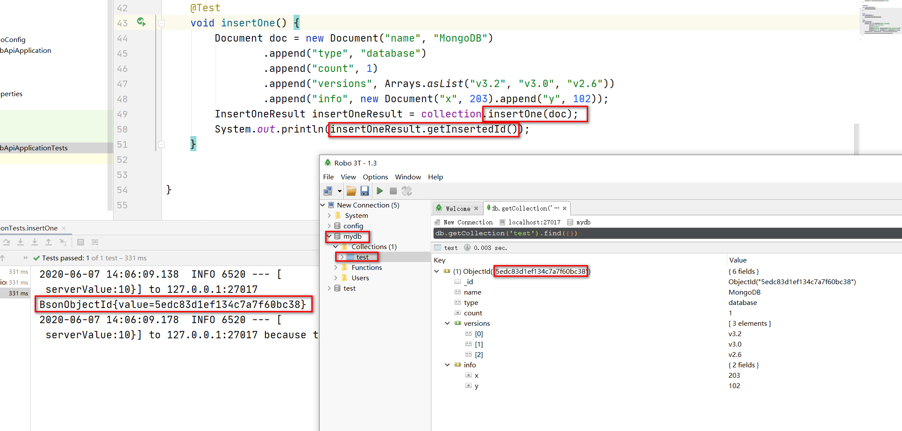

**如果文档中没有指定顶级_id字段，MongoDB会自动将_id字段添加到插入的文档中。**

* 要添加多个文档，可以使用集合的insertMany()方法，该方法接受要插入的文档列表。

```java
{ "i" : value }

List<Document> documents = new ArrayList<Document>();
for (int i = 0; i < 100; i++) {
    documents.add(new Document("i", i));
}

collection.insertMany(documents);
```

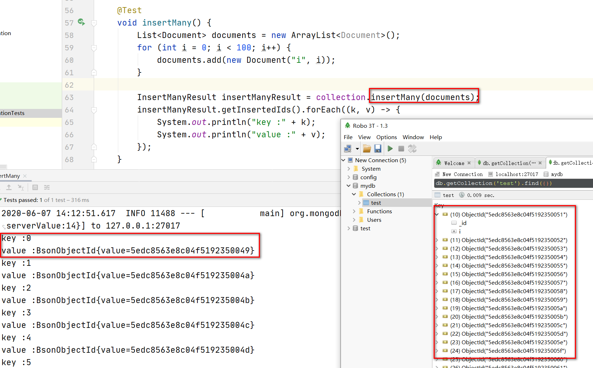

* 要计算集合中的文档数量，可以使用集合的countDocuments()方法。下面的代码应该打印101(通过insertMany插入的100加上通过insertOne插入的1)

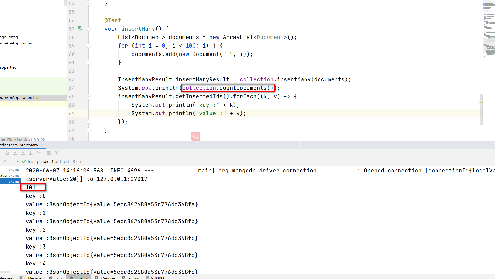

## 查询集合

* 要查询集合，可以使用集合的find()方法。可以不带任何参数调用该方法来查询集合中的所有文档，或者传递筛选器来查询匹配筛选条件的文档。

### 查询第一个

find().first()构造对于只匹配单个文档的查询或只对第一个文档感兴趣的查询很有用。  

如果集合为空，则操作返回null。

```java
Document myDoc = collection.find().first();
System.out.println(myDoc.toJson());
```

```json
{ "_id" : { "$oid" : "5edc86179f60572f7ae240b1" },
  "name" : "MongoDB",
  "type" : "database",
  "count" : 1,
  "info" : { "x" : 203, "y" : 102 } }
```

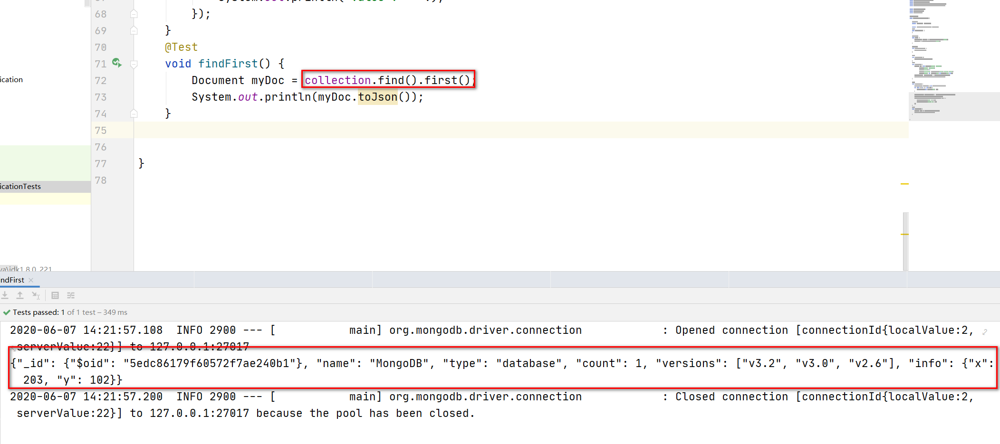

### 查找集合中的所有文档

为了检索集合中的所有文档，我们将使用不带任何参数的find()方法。

要遍历结果，可以将iterator()方法与find()链接起来。

下面的示例检索集合中的所有文档并打印返回的文档(101个文档):
```java
MongoCursor<Document> cursor = collection.find().iterator();
try {
    while (cursor.hasNext()) {
        System.out.println(cursor.next().toJson());
    }
} finally {
    cursor.close();
}
```

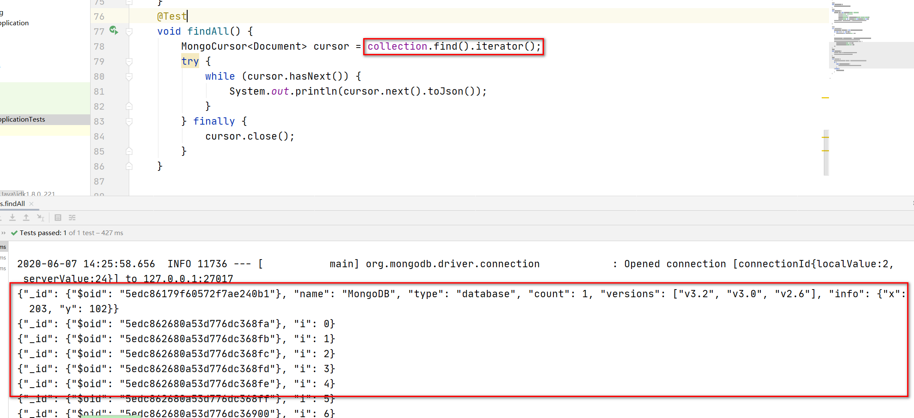

尽管下面的迭代习惯用法是允许的，但要避免使用它，因为如果循环提前终止，应用程序可能会泄漏游标:
```java
for (Document cur : collection.find()) {
    System.out.println(cur.toJson());
}
```

### 指定查询筛选器

要查询匹配特定条件的文档，请将筛选器对象传递给find()方法。为了方便创建筛选器对象，Java驱动程序提供了筛选器助手。

**获取与筛选器匹配的单个文档**

```java
 Document myDoc = collection.find(Filters.eq("i", 71)).first();
 System.out.println(myDoc.toJson());

{ "_id" : { "$oid" : "5515836e58c7b4fbc756320b" }, "i" : 71 }

```

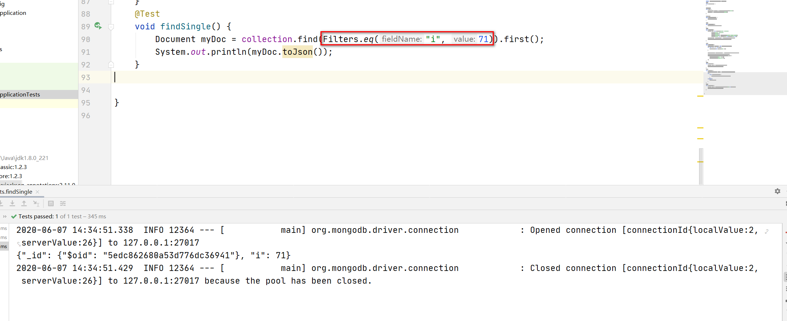

**获取与筛选器匹配的所有文档**

```java
    collection.find(Filters.gt("i", 50)).forEach(new Consumer<Document>() {
            @Override
            public void accept(Document document) {
                System.out.println(document.toJson());
            }
        });
```

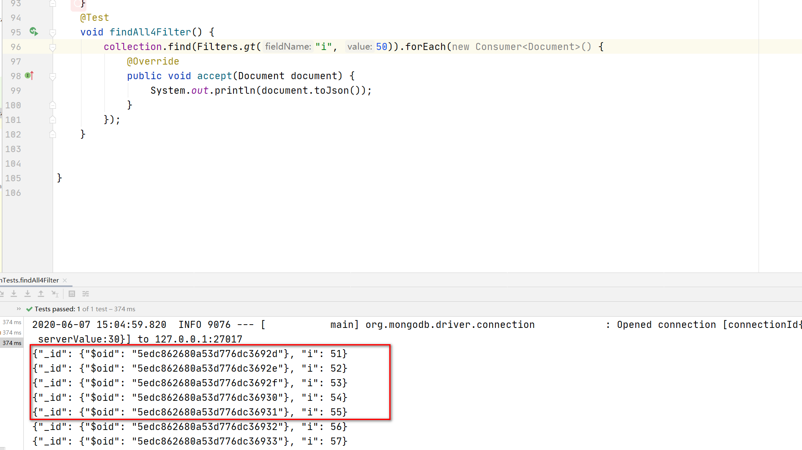
该示例使用FindIterable对象上的forEach方法对每个文档应用一个块。

要指定一个范围的过滤器，比如50 < i <= 100，可以使用and助手:

```java
        collection.find(Filters.and(Filters.gt("i", 50),
                Filters.lte("i", 100))).
                forEach(new Consumer<Document>() {
            @Override
            public void accept(Document document) {
                System.out.println(document.toJson());
            }
        });
```

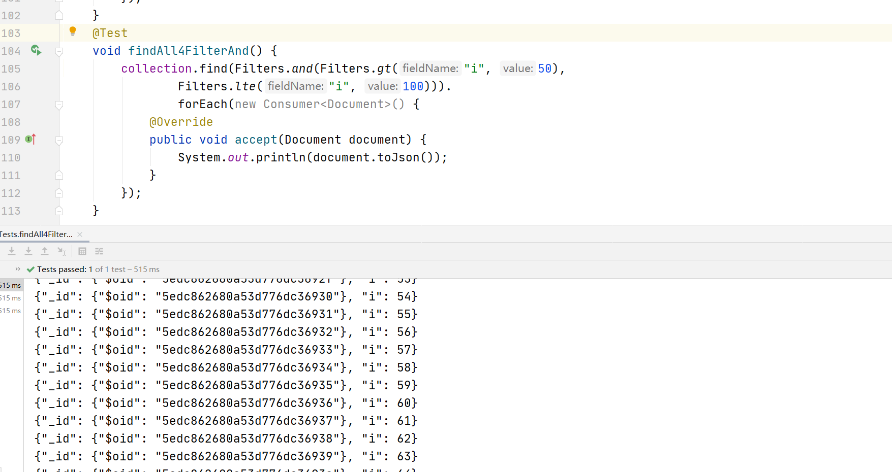

### 更新文档

要更新集合中的文档，可以使用集合的updateOne和updateMany方法。

**要更新集合中的文档，可以使用集合的updateOne和updateMany方法。**

```java
 collection.updateOne(Filters.eq("i", 10), Updates.set("i", 110));
```

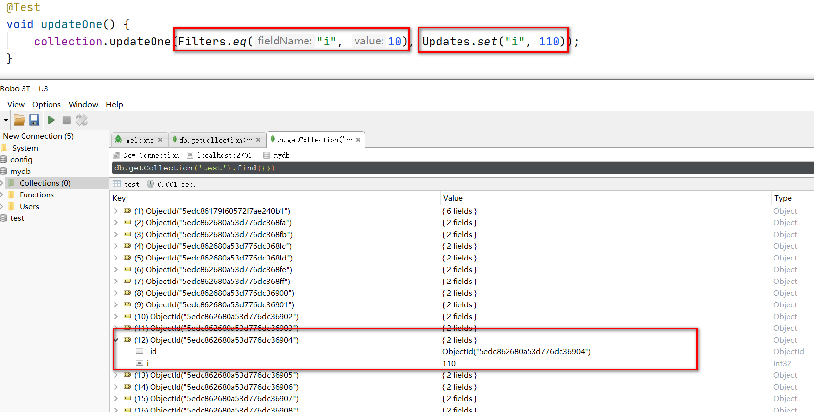

**更新多个文档**

```
 UpdateResult updateResult = collection.updateMany(Filters.lt("i", 100), Updates.inc("i", 100));
 System.out.println(updateResult.getModifiedCount());
```

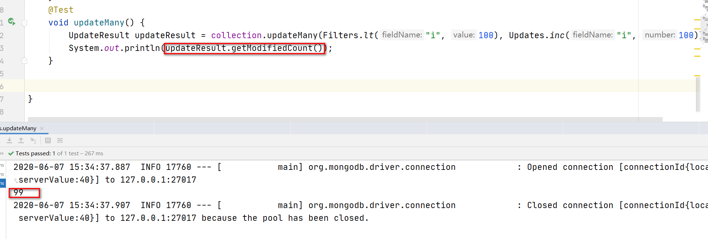

## 删除文档

**删除与筛选器匹配的单个文档**

```java
collection.deleteOne(Filters.eq("i", 110));
```

**删除与筛选器匹配的所有文档**

```java
DeleteResult deleteResult = collection.deleteMany(gte("i", 100));
System.out.println(deleteResult.getDeletedCount());
```

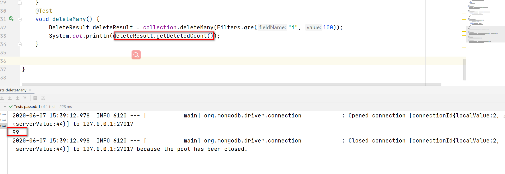

## 创建索引

要在一个或多个字段上创建索引，需要向createIndex()方法传递一个索引规范文档。索引键规范文档包含要索引的字段和每个字段的索引类型:

```java
 new Document(<field1>, <type1>).append(<field2>, <type2>) ...
```

 * 对于升序索引类型，为<type>指定1。
 * 对于降序索引类型，为<type>指定-1
 
下面的示例在i字段上创建升序索引:

 ```
collection.createIndex(new Document("i", 1));
```

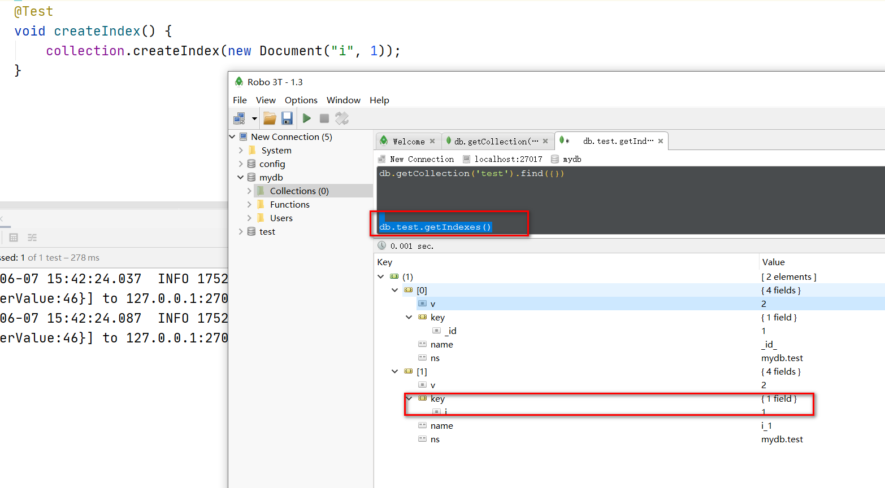

